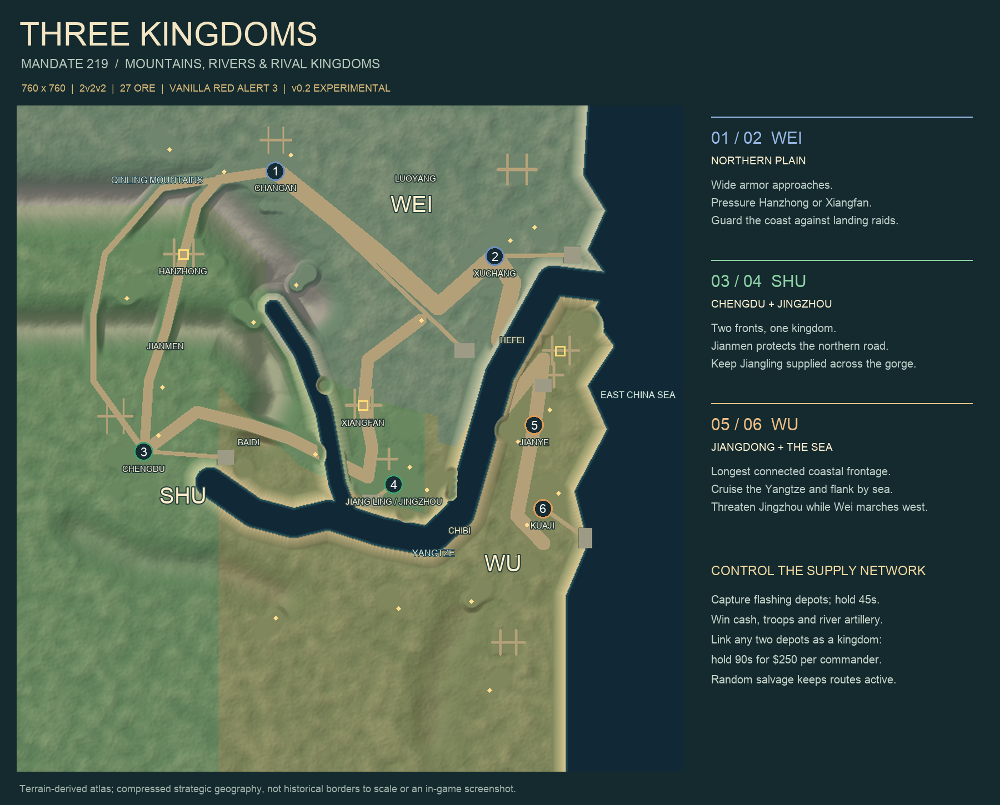

# Red Alert 3 Custom Maps

Four community maps for **Command & Conquer: Red Alert 3 — vanilla PC, patch 1.12**, by **Lightkeeper01**. Each map installs independently and uses the original game's factions. No additional mod is required.

**New: [Three Kingdoms — Mandate 219 v0.2](maps/three-kingdoms/README.md).** Fight as Wei, Shu and Wu across mountain passes, Jingzhou and the Yangtze. This update deepens the river and strengthens the Wei–Shu mountain barriers. Revised naval movement still needs in-game playtesting.

## Choose a map

Download a **Player ZIP** to play. Source bundles are for map makers.

| Map and guide | Play style | Player download | Validation status |
| --- | --- | --- | --- |
| [**Three Kingdoms: Mandate 219 v0.2**](maps/three-kingdoms/README.md) | 760 × 760; six players; fixed **2v2v2**; mountain passes, river warfare, supply links and relay rewards | [Player ZIP](https://github.com/Lightkeeper01/ra3-custom-maps/releases/download/three-kingdoms-v0.2/Three-Kingdoms-Mandate-219-v0.2.zip) | Experimental terrain revision; v0.1 reported playable, v0.2 engine navigation pending |
| [**Black Tide: Salvage Wars v1.0**](maps/black-tide/README.md) | 600 × 600; six island starts; raid squads, rotating contracts and random salvage | [Player ZIP](https://github.com/Lightkeeper01/ra3-custom-maps/releases/download/collection-2026-09-13/Black-Tide-v1.0.zip) | Experimental; automated checks passed, engine playtest pending |
| [**Strait Storm: Wild Supplies v1.2**](maps/strait-storm/README.md) | 760 × 760; large archipelago; 15 supply sites and capturable facilities | [Player ZIP](https://github.com/Lightkeeper01/ra3-custom-maps/releases/download/collection-2026-09-13/Strait-Storm-v1.2.zip) | Experimental; legacy Chinese captions may display incorrectly |
| [**Strait Reunification v0.9.2**](maps/strait-reunification/README.md) | Original six-player fictional strait battlefield; conventional skirmish | [Player ZIP](https://github.com/Lightkeeper01/ra3-custom-maps/releases/download/collection-2026-09-13/Strait-Reunification-v0.9.2.zip) | Author-reported playable |

[All releases and source downloads](https://github.com/Lightkeeper01/ra3-custom-maps/releases) · [What changed](CHANGELOG.md) · [Machine-readable catalog](maps/catalog.json)

## Install and start

1. Extract the entire **Player ZIP**, then run `Install-Map.cmd` or follow the [manual installation guide](docs/INSTALL.md).
2. Restart Red Alert 3 and begin a **new skirmish**. Old matches or saves can retain the old terrain.
3. For Three Kingdoms, assign **seats 1+2 to Wei, 3+4 to Shu, and 5+6 to Wu**, with a different team number for each pair. Set starting positions manually.

All four maps can coexist. Use identical map versions on every multiplayer machine. The game is not included; these maps are not for Red Alert 2, Uprising or other C&C titles.

*Terrain-derived planning illustration, not an in-game screenshot.*

## Find what you need

| Location | Contents |
| --- | --- |
| [maps/](maps/) | One directory per map: English guide, available preview images and validation evidence |
| [docs/INSTALL.md](docs/INSTALL.md) | Installation, updating and troubleshooting |
| [docs/DEVELOPMENT.md](docs/DEVELOPMENT.md) | Source bundles, checksums and the scope of development checks |
| [CHANGELOG.md](CHANGELOG.md) | Collection changes and per-release notes |
| [licenses/](licenses/) | Original EA and OpenSAGE license notices; [credits](docs/CREDITS.md) |
| [GitHub Releases](https://github.com/Lightkeeper01/ra3-custom-maps/releases) | Versioned player ZIPs, reproducible source bundles and SHA-256 checksums |

Archives are distributed through Releases, keeping the repository focused on browsable guides and evidence. **Code → Download ZIP** and GitHub's automatic **Source code** archives are not the playable map packages. The original collection release remains available.

## Feedback

[Report a bug or balance issue](https://github.com/Lightkeeper01/ra3-custom-maps/issues). Include the map version, RA3 patch, faction, starting seat, team settings and reproduction steps. For blocked movement, include the unit type and location; a screenshot or replay helps.

Automated checks and successful file installation do not prove engine pathfinding, multiplayer synchronization or competitive balance. Each map's guide describes its actual testing status.

Unofficial community project, not affiliated with or endorsed by EA. [Credits and license details](docs/CREDITS.md).
