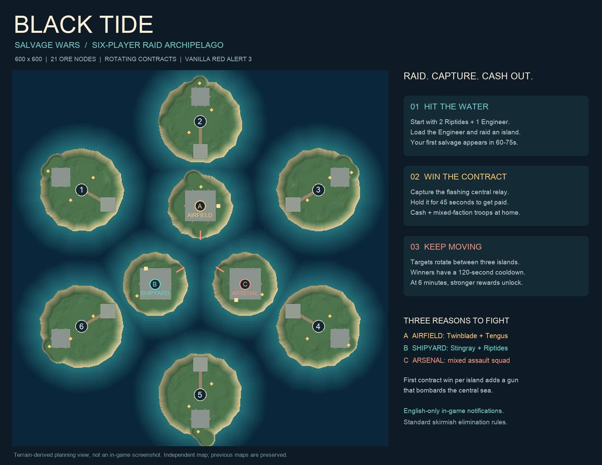

# Red Alert 3 Custom Maps

Three independent community maps for **Command & Conquer: Red Alert 3 (vanilla PC, patch 1.12)**, shared by **Lightkeeper01**. Download a player ZIP, extract it, install the map, and start a new skirmish. No additional mod is required.

**Start with Black Tide: Salvage Wars** for the newest objective-driven design: raid squads, rotating island contracts, randomized salvage, mixed-faction reinforcements and coastal artillery. This is an experimental map collection; each map's validation status is listed below.



*The overview is drawn from the delivered terrain data. It is a planning illustration, not an in-game screenshot.*

## Download and play

**Player ZIPs contain the actual playable maps.** The source ZIPs are optional tools for map makers, not the files you install into the game.

| Map | Player download | What to expect | Status |
| --- | --- | --- | --- |
| **Black Tide: Salvage Wars v1.0** | [Download Black Tide](https://github.com/Lightkeeper01/ra3-custom-maps/raw/refs/heads/main/Black-Tide-v1.0.zip) | Compact 600 x 600 arena, six starting islands, three objective islands, 21 ore nodes, English-only custom notifications | Experimental; automated checks passed, in-game playtest pending |
| **Strait Storm: Wild Supplies v1.2** | [Download Strait Storm](https://github.com/Lightkeeper01/ra3-custom-maps/raw/refs/heads/main/Strait-Storm-v1.2.zip) | Large 760 x 760 archipelago, 34 ore nodes, 15 possible supply locations, eight capturable facilities | Experimental; randomized revision needs in-game testing; legacy Chinese captions |
| **Strait Reunification v0.9.2** | [Download Strait Reunification](https://github.com/Lightkeeper01/ra3-custom-maps/raw/refs/heads/main/Strait-Reunification-v0.9.2.zip) | Original fictional six-player strait battlefield, 30 ore nodes, six oil derricks, conventional skirmish play | Author-reported playable |

[SHA-256 checksums](SHA256SUMS.txt) are provided for all player and source downloads. Every player ZIP also includes an English README, an installer, per-file checksums and license notices.

## Install on Windows

1. Download a **player ZIP** from the table and extract the entire archive.
2. Double-click `Install-Map.cmd`. Alternatively, follow the manual instructions below.
3. Restart Red Alert 3 and create a **new skirmish**. Select the corresponding map name:

| Download | Name in the game's map list | Folder to install |
| --- | --- | --- |
| Black Tide | `Black Tide - Salvage Wars [6P]` | `Black_Tide_6P` |
| Strait Storm | `Strait Storm - Wild Supplies [6P]` | `Strait_Storm_6P` |
| Strait Reunification | `Strait Reunification [6P]` | `Strait_Reunification_6P` |

### Manual installation

Press **Win+R**, enter `%APPDATA%\Red Alert 3\Maps`, and press Enter. If needed, create the `Maps` folder. Copy the complete map folder from the ZIP into it. For example:

```text
%APPDATA%\Red Alert 3\Maps\Black_Tide_6P\
    Black_Tide_6P.map
    Black_Tide_6P_art.tga
    Black_Tide_6P_pic.tga
    map.str
```

Do not add an extra nested directory. Install under the Windows user account that runs the game. All three map folders can coexist. The installer backs up an existing version of the same map in `%APPDATA%\Red Alert 3\CodexMapBackups` before copying files; it does not replace other map folders.

If the installer is blocked or hangs, use manual copying. There is no need to change your system-wide PowerShell execution policy. Remove just the relevant map folder to uninstall.

## Black Tide: how to play

**Raid early.** About seven seconds after the match begins, active players with a construction yard or MCV receive **two Riptides and one Allied Engineer**. Put the Engineer into a Riptide and head toward a central island. Your chosen vanilla faction does not restrict these bonus units.

**Watch for salvage.** The first cache appears after roughly 60-75 seconds, with a 10-second warning. Move any unit close to the flashing cache to claim it. A cache lasts 70 seconds; an unclaimed or destroyed cache is removed. After each event ends, a new 45-75 second random wait begins, followed by the next warning.

Salvage can award **$1000, $1800, two Riptides, two Tengus, a Twinblade, or an Engineer plus a Riptide**. Cash is immediate; bonus units arrive at your original home island's landing area facing the center. Keep that area clear and move reinforcements out promptly.

**Capture the active relay.** The first contract opens around 85 seconds. Use an Engineer to capture the flashing **Observation Post**, then keep it under your ownership for **45 uninterrupted seconds**. Losing control resets the attempt. Capturing the nearby support building is useful, but does not complete the relay contract.

| Objective island | Reward before 6 minutes | Reward after 6 minutes | Nearby capturable support |
| --- | --- | --- | --- |
| AIRFIELD, north | 1 Twinblade + 1 Tengu | 1 Twinblade + 2 Tengus | Veteran Academy |
| SHIPYARD, southwest | 1 Stingray + 2 Riptides | 2 Stingrays + 1 Riptide | Dry Dock |
| ARSENAL, southeast | 2 Tengus + 1 Riptide | 3 Tengus + 1 Riptide | Hospital |

A successful contract also pays **$1500**, increasing to **$2200 after six minutes**. The winner has a personal **120-second contract cooldown**. Contracts rotate between the three islands; each has a 150-second window, followed by a 20-second transition after completion or expiry. Destroyed relay buildings are skipped in later rotations.

The first successful contract on each island additionally creates a player-owned **coastal gun**. It bombards a fixed point in the central sea. There are at most three guns; destruction does not respawn them, and later relay captures do not automatically transfer existing guns. These native guns have limited firing arcs and can cause friendly fire; they are not automatic 360-degree naval turrets.

All maps retain **standard skirmish elimination**. Contracts help fund your attacks; they are not an alternative victory condition. Select factions, teams and AI difficulty in the lobby. Human opponents can intentionally contest objectives; the standard AI has no custom contract-planning logic.

## Compatibility and known limitations

- Requires a separate installation of **Red Alert 3**, preferably patch **1.12**. The game itself is not included.
- These are vanilla RA3 maps, not Red Alert 2 or Uprising maps. Other C&C titles are not supported.
- Native factions remain Allies, Soviets and Empire. Fictional country labels in the strait scenario do not add new playable national factions or a real-world military simulation.
- Black Tide's custom map notifications use **English ASCII**. Strait Storm retains older Chinese event text that may display incorrectly on some installations. The underlying game's interface language is unchanged.
- Use matching map versions on every multiplayer machine. Actual multiplayer synchronization, all faction build interactions, AI behavior and match completion have not been comprehensively verified.
- Black Tide passed terrain/ore/refinery/landing-area checks, native file round trips and **19 scripted behavior-model scenarios**. Its source bundle rebuilt to a byte-identical map. These are development checks, not proof of correct execution in the RA3 engine or a guarantee of gameplay balance.
- The original Strait Reunification map was reported playable by the author. Newer event revisions still need community playtesting.

If a map does not appear, check the installation folder and restart the game. If you see black terrain, garbled captions, blocked refinery placement or a crash, report the exact version rather than mixing files from different releases.

## Source downloads

| Map | Source archive |
| --- | --- |
| Black Tide v1.0 | [Download source](https://github.com/Lightkeeper01/ra3-custom-maps/raw/refs/heads/main/Black-Tide-v1.0-Source.zip) |
| Strait Storm v1.2 | [Download source](https://github.com/Lightkeeper01/ra3-custom-maps/raw/refs/heads/main/Strait-Storm-v1.2-Source.zip) |
| Strait Reunification v0.9.2 | [Download source](https://github.com/Lightkeeper01/ra3-custom-maps/raw/refs/heads/main/Strait-Reunification-v0.9.2-Source.zip) |

All three public source archives were extracted into clean directories and rebuilt to byte-identical native maps; see [source verification](SOURCE-VERIFICATION.json).

Extract a source archive into an empty directory and follow its README. The source bundles include the map generators and their asset/format references; they retain original project paths and some Chinese developer documentation. Player-facing installation instructions in this repository and the public player ZIPs are in English.

## Feedback

Please [open an issue](https://github.com/Lightkeeper01/ra3-custom-maps/issues) with:

- Map name and version; game version and any mods.
- Player slot, faction, AI difficulty and team configuration.
- What happened, what you expected, and approximate in-game time.
- Reproduction steps and, when useful, a screenshot or replay.

Balance feedback is welcome: tell us which objective felt worth fighting for, which reward dominated, and where the game became slow or repetitive.

## Credits and licenses

Published by **Lightkeeper01** as an unofficial community map collection.

- [EA CnC Modding Support](https://github.com/electronicarts/CnC_Modding_Support): native RA3 map/object references and associated assets. See [LICENSE-EA.md](LICENSE-EA.md).
- [OpenSAGE](https://github.com/OpenSAGE/OpenSAGE): file-format research/reference material. See [LICENSE-OpenSAGE.md](LICENSE-OpenSAGE.md) and [LICENSE-OpenSAGE-EA.md](LICENSE-OpenSAGE-EA.md).

Preserve the supplied copyright and license notices when redistributing the corresponding material. The individual bundled licenses govern their respective material; this repository does not relicense EA assets as MIT or place them in the public domain. Command & Conquer and Red Alert are Electronic Arts trademarks. This project is not affiliated with or endorsed by EA.
